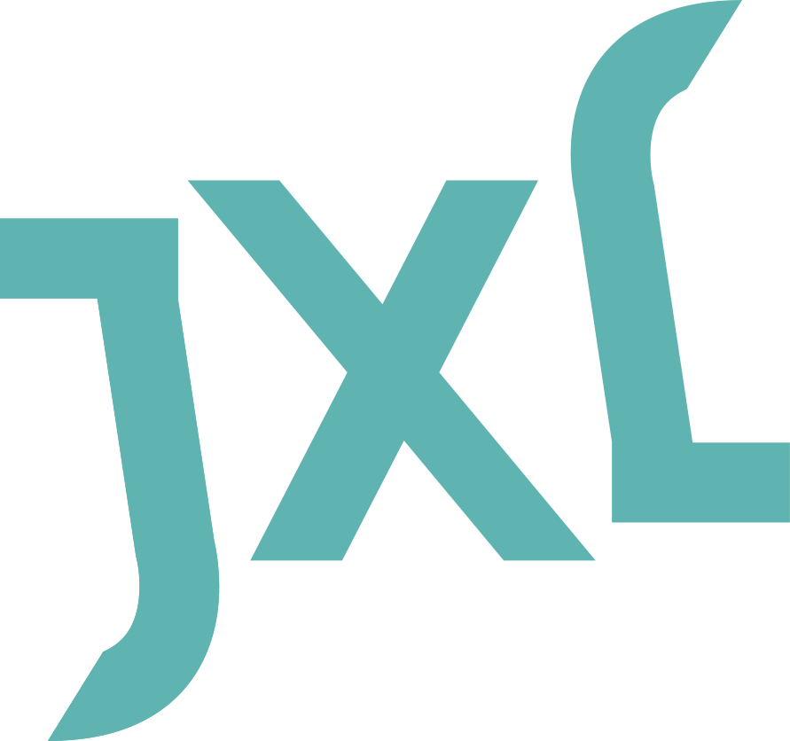

# JPEG XL reference implementation

This is a stripped-down version of [libjxl](https://github.com/libjxl/libjxl), intended for projects that need a lightweight option to include as a submodule.
1. Only the core library (encoding/decoding) is retained
2. Only supports msys2 / gcc / clang under x86
3. Fixed use of skcms
4. Remove all install stuff

## libjxl-lite Tools (this fork)
1. cli: Command-line encoder/decoder
2. gui: Encoder/decoder with a graphical interface

You can find [document](https://libjxl.readthedocs.io/en/latest/) here

Please refer to [libjxl](https://github.com/libjxl/libjxl) for more information

## License

This software is available under a 3-clause BSD license which can be found in
the [LICENSE](LICENSE) file, with an "Additional IP Rights Grant" as outlined in
the [PATENTS](PATENTS) file.

Please note that the PATENTS file only mentions Google since Google is the legal
entity receiving the Contributor License Agreements (CLA) from all contributors
to the JPEG XL Project, including the initial main contributors to the JPEG XL
format: Cloudinary and Google.
