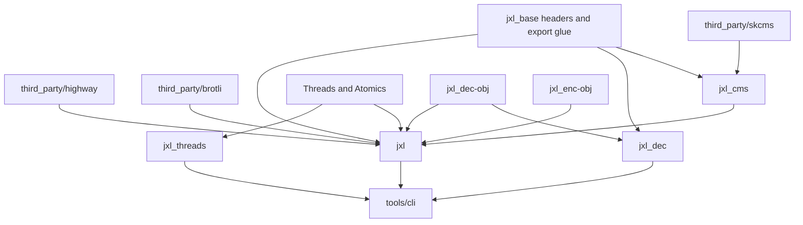
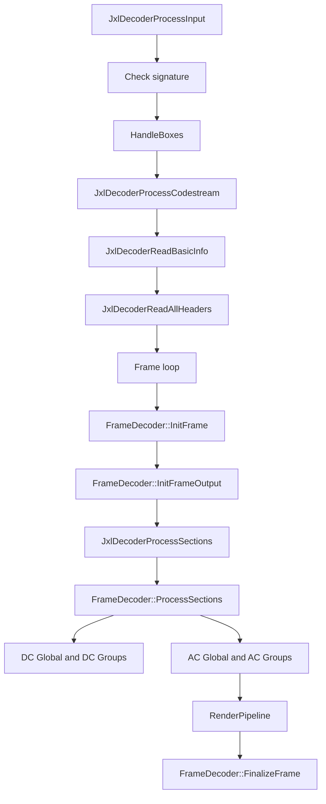
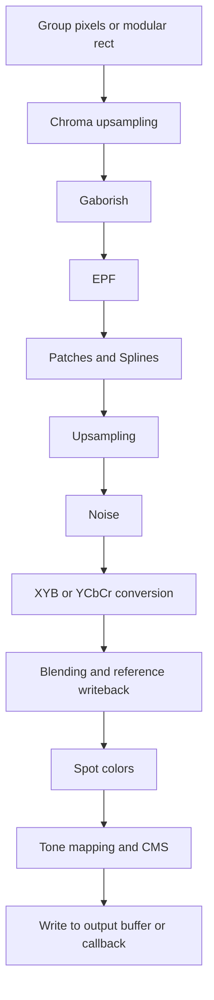
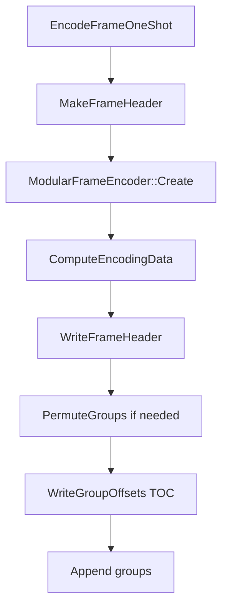
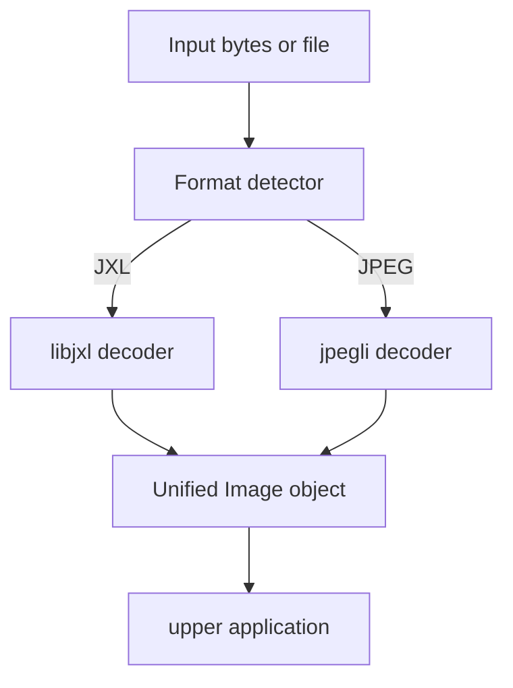

# libjxl-lite 技术文档（工作原理、依赖、模块划分、JXL 编解码调用栈、jpegli 关系）

> 面向当前仓库：`libjxl`（这是一个裁剪过的 `libjxl` fork，而不是 upstream 完整仓库）

## 1. 文档目标

本文档描述这个 fork 的：

1. **整体架构与工作原理**
2. **构建依赖与产物关系**
3. **各目录 / 模块的职责**
4. **JXL 编码 / 解码的真实调用栈**
5. **仓库里 `lib/jpegli/` 的定位**
6. **如何让同一个工程同时支持 JXL 和 JPEG**

---

## 2. 先说结论

### 2.1 这个仓库的本质

这个 fork 是一个“**精简版 libjxl**”，重点保留：

- JXL 核心编码 / 解码库
- 线程运行器
- CMS（颜色管理）
- 一个简单的 CLI / GUI 工具

从 `README.md` 和 `CMakeLists.txt` 看，这个 fork 明确做了这些裁剪：

- 只保留核心库
- 偏向 x86 / gcc / clang / msys2 的轻量构建
- 固定使用 `skcms`
- 去掉安装逻辑与大量外围内容

### 2.2 `jpegli` 是什么

`lib/jpegli/` **不是 JXL 解码器的一部分**，也不是“JXL 内部拿来解 JPEG 的隐藏模块”。

它是一个**独立的 JPEG 编码 / 解码实现**，目标是：

- **API / ABI 兼容 libjpeg62**
- 可以作为 `libjpeg.so` 的 drop-in replacement
- 使用了 libjxl / JPEG XL 项目里的一些图像编码经验来改进 JPEG 编码质量和解码精度

它的 README 已明确说明：

- 它是 “Improved JPEG encoder and decoder implementation”
- 与 `libjpeg62` API/ABI 兼容
- 开发后来迁移到了 `https://github.com/google/jpegli`

### 2.3 JXL 与 JPEG 在这个仓库里其实有两条完全不同的“JPEG 相关路径”

很多人第一次看这个仓库会把它们混在一起，但实际上是两层东西：

#### A. `lib/jxl/jpeg/*`

这是 **libjxl 内部的 JPEG 语法/数据结构支持**，用于：

- `JxlEncoderAddJPEGFrame()`：把 JPEG 输入“无损重压缩”成 JXL
- `JXL_DEC_JPEG_RECONSTRUCTION`：把这种 JXL 里的 JPEG 重建信息还原成原始 JPEG bitstream

也就是说，这部分是 **JXL <-> JPEG 转码 / 重建** 的内部实现。

#### B. `lib/jpegli/*`

这是一个**独立 JPEG codec**：

- 能直接读 JPEG
- 能直接写 JPEG
- 提供 libjpeg 风格 API

也就是说，这部分是 **真正的 JPEG 编解码器库**。

### 2.4 能不能做成“一个库同时支持 JXL + JPEG”？

**可以，但最好的方式不是把 `jpegli` 硬塞进 `JxlDecoder/JxlEncoder` API。**

推荐优先级如下：

1. **最推荐：做一个 wrapper / facade**，统一探测格式并分发到 `libjxl` 或 `jpegli`
2. **次推荐：同仓库同构建系统，但仍保持两个独立库**
3. **不太推荐：把原始 JPEG 解码直接并入 `JxlDecoder` 公共 API**

原因很简单：

- `JxlDecoder` 的事件模型、box、preview、progression、JPEG reconstruction 等概念都明显是 **JXL-centric** 的
- 原始 JPEG 没有这些语义
- 如果把 JPEG 直接塞进 `JxlDecoder`，API 会变得很奇怪，长期维护成本也高

---

## 3. 当前 fork 的构建与产物

### 3.1 顶层构建逻辑

入口在：

- `CMakeLists.txt`
- `lib/CMakeLists.txt`
- `lib/jxl.cmake`
- `lib/jxl_cms.cmake`
- `lib/jxl_threads.cmake`

这个 fork 的顶层做了几件事：

- 强制 `BUILD_SHARED_LIBS=OFF`
- 默认构建核心库和工具
- 固定启用 `skcms`
- 引入 `third_party/` 中的依赖
- 构建 `lib/` 下的库
- 按平台构建 `tools/`

### 3.2 实际公共产物

这个 fork 主要会得到这些 target：

- `jxl`：公开的 JXL 编码/解码库
- `jxl_dec`：公开的解码-only 库
- `jxl_cms`：颜色管理子库
- `jxl_threads`：线程并行运行器
- `tools/cli`
- 可选 `tools/gui`

### 3.3 目标关系



### 3.4 一个非常重要的 fork 特征：`jpegli` 代码在树里，但当前并没有接进构建

虽然仓库里存在：

- `lib/jpegli/`
- `lib/jpegli.cmake`

但当前 `lib/CMakeLists.txt` 实际只包含：

- `jxl_cms.cmake`
- `jxl.cmake`
- `jxl_threads.cmake`

**没有 `include(jpegli.cmake)`**。

因此，**当前 fork 默认并不会构建 `jpegli`**。

另外，`lib/jpegli.cmake` 还会引用：

- `third_party/libjpeg-turbo/jpeglib.h`
- `third_party/libjpeg-turbo/jmorecfg.h`
- `third_party/libjpeg-turbo/jconfig.h.in`

而这个 fork 当前并没有保留 `third_party/libjpeg-turbo/` 目录。

所以从工程状态看：

- `jpegli` 源码被保留了
- 但它在这个 fork 中目前更像“保留的 upstream 子树”
- **不是已经接通的功能**

---

## 4. 外部依赖

### 4.1 核心依赖

#### `third_party/highway`

作用：

- SIMD 抽象层
- 运行时 / 编译期选择 SSE4 / AVX2 / AVX512 等优化实现

在代码里经常看到：

- `HWY_DYNAMIC_DISPATCH(...)`
- `#include <hwy/foreach_target.h>`

这说明 libjxl 的很多热路径都有 Highway 加速，尤其是：

- DCT / IDCT 相关
- group 解码
- modular 转换
- JPEGli 内部处理

#### `third_party/brotli`

作用：

- JXL 容器里的 `brob` box 解压 / 压缩
- JPEG reconstruction / box metadata 的相关压缩支持

#### `third_party/skcms`

作用：

- 颜色空间变换
- ICC profile 处理
- `jxl_cms` 子库的实际实现依赖

### 4.2 系统依赖

- `Threads`
- `Atomics`

用于：

- `ThreadPool`
- `JxlThreadParallelRunner`
- `JxlResizableParallelRunner`

### 4.3 tools 的额外依赖

`tools/` 依平台可选：

- `stb_image` / `stb_image_write`
- WIC（Windows）
- ImageMagick
- FreeImage
- `exiv2` / `gexiv2`
- `gtkmm-4.0`

注意：这些是**工具层的输入输出依赖**，不是核心 JXL codec 必需依赖。

---

## 5. 目录与模块说明

## 5.1 `lib/include/jxl/`：公开 C/C++ API

关键头文件：

- `lib/include/jxl/decode.h`
- `lib/include/jxl/encode.h`
- `lib/include/jxl/decode_cxx.h`
- `lib/include/jxl/encode_cxx.h`
- `lib/include/jxl/thread_parallel_runner.h`
- `lib/include/jxl/resizable_parallel_runner.h`
- `lib/include/jxl/cms.h`

这层是用户真正会 include 的 API。

### 设计风格

- **Decoder 是事件驱动的 pull 模型**
  - `JxlDecoderProcessInput()` 不断返回状态/事件
- **Encoder 是队列 + 输出拉取模型**
  - 先 `AddImageFrame / AddJPEGFrame`
  - 再 `JxlEncoderProcessOutput()` 拉取字节流

---

## 5.2 `lib/jxl/base/`：基础设施层

职责：

- 平台宏 / 编译器宏
- `Span`
- `Status`
- 字节序
- 并行调度辅助
- 常用数学/位操作

这是整个工程的“底板”。

---

## 5.3 `lib/jxl/fields.*`、`headers.*`、`frame_header.*`：比特流字段系统

这是 libjxl 一个非常关键的架构点。

### 核心思想

很多头部结构不是手写 bitstream parser，而是通过一个“**字段访问器（Visitor）**”系统序列化/反序列化：

- `Fields`
- `Bundle::Read()`
- `Bundle::Write()`
- `ReadVisitor`
- `InitVisitor`
- `SetDefaultVisitor`

对应文件：

- `lib/jxl/fields.cc`
- `lib/jxl/fields.h`
- `lib/jxl/headers.cc`
- `lib/jxl/frame_header.h`

### 作用

统一处理：

- 默认值
- 条件字段
- 扩展字段
- U32/U64/Bits/F16 编解码

这个机制贯穿：

- codestream header
- size header
- animation header
- frame header
- 许多内部结构

这是 libjxl 能保持格式演进能力的基础之一。

---

## 5.4 `lib/jxl/image_metadata.*` / `image_bundle.*`：内存语义模型

### `CodecMetadata` / `ImageMetadata`

描述整个 codestream 层面的信息：

- 尺寸
- 颜色编码
- bit depth
- extra channels
- animation
- preview
- tone mapping
- orientation

### `ImageBundle`

表示一帧图像在内存中的承载体：

- 颜色平面
- extra channels
- 或者 `jpeg_data`
- blend / duration / timecode / origin

非常重要的一点：

- `ImageBundle` 不只是“像素缓冲区”
- 它还是编码器/解码器在各阶段传递一帧图像语义的统一对象

---

## 5.5 `lib/jxl/encode.cc` / `decode.cc`：公开 API 的真正实现入口

这两个文件是外部 API 到内部实现的总调度器。

### `decode.cc`

负责：

- `JxlDecoderCreate/Destroy/Reset`
- `JxlDecoderSetInput/ReleaseInput`
- `JxlDecoderSubscribeEvents`
- `JxlDecoderProcessInput`
- box / container 处理
- frame 生命周期驱动

### `encode.cc`

负责：

- `JxlEncoderCreate/Destroy/Reset`
- `JxlEncoderSetBasicInfo/SetColorEncoding`
- `JxlEncoderAddImageFrame`
- `JxlEncoderAddJPEGFrame`
- `JxlEncoderAddBox`
- `JxlEncoderProcessOutput`

可以把这两者看成：

- **对外 API 适配层**
- **状态机控制层**
- **输出 / 输入缓冲管理层**

---

## 5.6 `lib/jxl/dec_frame.*` / `enc_frame.*`：帧级别主流程

这是实际编码 / 解码的核心骨架。

### `dec_frame.cc`

负责：

- 解析 frame header
- 读取 TOC
- 组织 section / group 解码
- 构造 render pipeline
- progressive / DC / AC 的阶段推进
- frame finalize

### `enc_frame.cc`

负责：

- 从输入像素/JPEG 生成 frame encoding data
- 确定 VarDCT / Modular 路径
- 计算 DC / AC / modular 数据
- 写出 group / TOC / frame header
- one-shot 与 streaming 两条编码路径

---

## 5.7 `lib/jxl/enc_group.*` / `dec_group.*`：AC group 热路径

JXL 会把图像切成 groups（通常是 256x256 的逻辑区域）。

这层负责：

- VarDCT block 系数的编码 / 解码
- tokenization / entropy coding
- group 级别的逆变换输入准备
- 与 render pipeline 对接

这是性能最敏感的一层之一。

---

## 5.8 `lib/jxl/modular/` + `enc_modular.*` / `dec_modular.*`

这是 JXL 的 **Modular** 编码体系。

用于：

- 真正的无损编码
- palette / RCT / predictor / MA tree
- 某些 extra channel / DC / AC metadata 的表示
- VarDCT 流程里“非 DCT 的那部分”

不要把 “Modular” 理解成一个完全独立文件格式；更准确地说：

- 它是 JPEG XL 规范中的一种**主编码模式**
- 也是 VarDCT 模式里一些子数据流的编码机制

---

## 5.9 `lib/jxl/render_pipeline/`：像素重建管线

这是解码后半程的关键。

它把“解码出来的 group 数据”逐步处理成最终输出像素。

常见 stage：

- chroma upsampling
- Gaborish
- EPF
- patches
- splines
- upsampling
- noise
- XYB -> linear/RGB
- YCbCr -> RGB
- blending
- spot colors
- tone mapping
- CMS
- write stage

对应文件：

- `render_pipeline/render_pipeline.h`
- `render_pipeline/stage_xyb.cc`
- `render_pipeline/stage_ycbcr.cc`
- `render_pipeline/stage_epf.cc`
- `render_pipeline/stage_write.cc`
- 等等

---

## 5.10 `lib/jxl/jpeg/`：JXL 内部 JPEG 转码 / 重建支持

这是最容易和 `jpegli` 混淆的部分。

这里的职责是：

- 解析 JPEG 到内部结构 `jpeg::JPEGData`
- 把 `JPEGData` 重新编码为 JXL 可保存的重建信息
- 从 JXL 中恢复出原始 JPEG bitstream

关键文件：

- `lib/jxl/jpeg/jpeg_data.h`
- `lib/jxl/jpeg/enc_jpeg_data.cc`
- `lib/jxl/jpeg/dec_jpeg_data.cc`
- `lib/jxl/decode_to_jpeg.cc`

### 这部分不是面向外部的“通用 JPEG decoder API”

它的目标不是替代 `libjpeg`，而是服务于：

- `JxlEncoderAddJPEGFrame()`
- `JXL_DEC_JPEG_RECONSTRUCTION`

---

## 5.11 `lib/jpegli/`：独立 JPEG 编解码库

职责：

- 提供 libjpeg 风格 API
- 改进 JPEG 编码质量与解码精度
- 作为单独的 JPEG 库使用

关键文件：

- `lib/jpegli/decode.cc`
- `lib/jpegli/encode.cc`
- `lib/jpegli/libjpeg_wrapper.cc`

其中：

- `libjpeg_wrapper.cc` 明确导出 `jpeg_*` 符号
- 本质上是在构建一个 ABI 兼容的 `libjpeg.so`

---

## 5.12 `lib/threads/`：并行运行器

这层提供：

- `JxlThreadParallelRunner`
- `JxlResizableParallelRunner`

对应：

- `lib/threads/thread_parallel_runner.cc`
- `lib/threads/resizable_parallel_runner.cc`

它是 libjxl 公共 API 中“并行执行器”那层实现。

---

## 5.13 `tools/`

这个 fork 的工具层比较轻，主要是：

- `tools/cli.cc`
- `tools/gui.gtk.cc`

它们负责：

- 读普通图片格式
- 调用 libjxl 编码/解码
- 把结果写回普通格式

注意这里的 JPEG 输入输出更多依赖外围 I/O 库（stb/WIC/ImageMagick/FreeImage），**不是通过 jpegli 自动完成的**。

---

## 6. JPEG XL 数据层的工作原理

## 6.1 容器层 vs 裸 codestream

JXL 有两种外部形式：

1. **裸 codestream**
   - 开头签名是 `FF 0A`
2. **BMFF container**
   - 开头是 `JXL ` signature box
   - 后面可有 `ftyp`、`jxlc`、`jxlp`、`Exif`、`xml `、`jumb`、`brob` 等 box

`decode.cc` 的流程就是：

- 先识别签名
- 若是 container，则走 box 状态机
- 进入 codestream box 后再解析真正的 JXL 图像数据

---

## 6.2 两种主编码模式

### A. VarDCT

更适合照片类图像，主要特征：

- 颜色通常先变到 XYB
- 做块变换（DCT/可变 block strategy）
- 分离 DC / AC
- 通过多 pass / progressive 方式编码
- 再结合 modular 保存一部分附加数据

### B. Modular

更适合：

- 无损
- palette 图
- 额外通道
- 高精度整数图

其核心工具：

- predictor
- RCT
- palette
- squeeze
- MA tree
- context modeling

---

## 6.3 Frame / Group / Pass

JXL 的帧内部大致可理解为：

- **Frame**：一帧图像/动画帧
- **DC Global**：全局 DC 侧信息
- **DC Groups**：按区块拆分的 DC 数据
- **AC Global**：全局 AC 侧信息（量化矩阵、上下文、系数顺序等）
- **AC Groups**：真正分块存储的高频信息
- **Passes**：渐进式层次（progressive）

编码器先把这些 section 准备好，再写 TOC；
解码器先读 TOC，再按 section 组织解码。

---

## 7. 解码调用栈（最重要部分）

下面分成“外部 API 栈”和“内部核心栈”两部分。

## 7.1 外部 API 典型用法

典型调用序列可参考：

- `examples/decode_oneshot.cc`
- `tools/cli.cc`

大致是：

```text
JxlDecoderCreate
  -> JxlDecoderSubscribeEvents
  -> JxlDecoderSetParallelRunner
  -> JxlDecoderSetInput
  -> loop:
       JxlDecoderProcessInput
         -> BASIC_INFO
         -> COLOR_ENCODING
         -> NEED_IMAGE_OUT_BUFFER
         -> FULL_IMAGE
         -> SUCCESS
```

---

## 7.2 解码总入口

公开入口在：

- `lib/jxl/decode.cc`
- 关键函数：`JxlDecoderProcessInput()`

主流程：



---

## 7.3 `JxlDecoderProcessInput()`

文件：`lib/jxl/decode.cc`

职责：

1. 检查签名
2. 判断是裸 codestream 还是 container
3. 调用 `HandleBoxes()`
4. 在 box 状态机中把 codestream 部分交给 `JxlDecoderProcessCodestream()`

如果是 container，则还负责处理：

- `jxlc` / `jxlp`
- `Exif` / `xml ` / `jumb`
- `brob`
- 可选 `jbrd`（JPEG reconstruction）

---

## 7.4 `JxlDecoderProcessCodestream()`

这是 codestream 层面的解码总调度。

它依次做：

1. `JxlDecoderReadBasicInfo()`
   - 读 codestream marker
   - 读 `SizeHeader`
   - 读 `ImageMetadata`
2. `JxlDecoderReadAllHeaders()`
   - 读 transform data
   - 读 ICC（如果需要）
   - 初始化 `PassesDecoderState`
3. 进入 frame loop

### 对应事件返回点

它会在合适时机返回：

- `JXL_DEC_BASIC_INFO`
- `JXL_DEC_COLOR_ENCODING`
- `JXL_DEC_FRAME`
- `JXL_DEC_NEED_IMAGE_OUT_BUFFER`
- `JXL_DEC_FRAME_PROGRESSION`
- `JXL_DEC_FULL_IMAGE`

所以 public decoder 看起来是“事件驱动”，但内部其实是一个非常明确的分阶段状态机。

---

## 7.5 Frame 入口：`FrameDecoder::InitFrame()`

文件：`lib/jxl/dec_frame.cc`

调用关系：

```text
JxlDecoderProcessCodestream
  -> FrameDecoder::InitFrame
```

职责：

1. `ReadFrameHeader()`
2. 计算 `FrameDimensions`
3. 清空/重置 `ImageBundle`
4. 读取 TOC：`ReadToc()`
5. 建立 section id -> size 的映射

这一步之后，解码器已经知道：

- 这一帧是什么模式（VarDCT / Modular）
- 有几组 DC / AC group
- 有多少 progressive pass
- 每个 section 有多大

---

## 7.6 `FrameDecoder::InitFrameOutput()`

职责：

1. `InitializePassesSharedState()`
2. `PassesDecoderState::Init()`
3. `modular_frame_decoder_.Init(frame_dim_)`
4. 如果目标是 JPEG 重建，则初始化 `JPEGData`
5. 重置 frame 解码状态

这里会建立解码时共享的核心状态：

- `PassesSharedState`
- quantizer / dequant matrices
- AC strategy
- quant field
- color correlation map
- reference frames
- DC storage

---

## 7.7 `JxlDecoderProcessSections()` -> `FrameDecoder::ProcessSections()`

这一步是**真正开始消耗 frame section 数据**的地方。

`decode.cc` 先按 TOC 把 section 切成多个 `BitReader`，然后调用：

```text
FrameDecoder::ProcessSections(section_info, section_status)
```

### `ProcessSections()` 的内部阶段

#### 第 1 阶段：DC Global

- `ProcessDCGlobal()`

职责：

- patch dictionary
- splines
- noise 参数
- DC dequant matrix
- `DecodeGlobalDCInfo()`
- `modular_frame_decoder_.DecodeGlobalInfo()`

#### 第 2 阶段：DC Groups

- `ProcessDCGroup()`

职责：

- 如果是 VarDCT：`DecodeVarDCTDC()`
- 解 modular DC group：`ModularFrameDecoder::DecodeGroup()`
- 读 AC metadata：`DecodeAcMetadata()`
- 计算 EPF sigma（modular 情况）

#### 第 3 阶段：Finalize DC

- `FinalizeDC()`

职责：

- 执行 Adaptive DC Smoothing（若启用）

#### 第 4 阶段：准备渲染管线

- `PassesDecoderState::PreparePipeline()`
- `AllocateOutput()`

职责：

- 构建 render pipeline stage 链
- 准备 group 输出缓存
- 设置引用帧/输出图像等

#### 第 5 阶段：AC Global

- `ProcessACGlobal()`

职责：

- 读取完整 dequant matrices
- 读取 coeff orders
- 读取 histograms / context map
- 为系数缓冲区分配空间
- 如果目标是 JPEG，则填充 JPEG quant tables 等信息

#### 第 6 阶段：AC Groups

- `ProcessACGroup()`

职责：

- 对 VarDCT：`DecodeGroup()`
- 对 Modular pass：`ModularFrameDecoder::DecodeGroup()`
- 条件触发 render pipeline

---

## 7.8 VarDCT 组解码深一点：`DecodeGroup()`

文件：`lib/jxl/dec_group.cc`

调用链：

```text
FrameDecoder::ProcessACGroup
  -> DecodeGroup
     -> GetBlockFromBitstream::Init
     -> HWY_DYNAMIC_DISPATCH(DecodeGroupImpl)
```

这层负责：

- 从 ANS bitstream 读 AC token
- 恢复 non-zero map
- 反量化
- 逆变换
- 把结果写入 render pipeline 输入缓冲

如果是最终 pass 或被要求 force draw，就会真正“画”到像素域；否则可能只积累中间状态。

---

## 7.9 Modular 组解码：`ModularFrameDecoder::DecodeGroup()`

文件：`lib/jxl/dec_modular.cc`

职责：

- 依据 stream id（ModularDC / ModularAC）解码 modular image 片段
- 需要时执行全局变换逆过程
- 把 modular 数据转成 render pipeline 能吃的浮点输入

当整帧都齐了以后，还会在：

- `ModularFrameDecoder::FinalizeDecoding()`

里做：

- 全局 modular transform 逆变换
- 把整幅 modular image 分 group 喂入 render pipeline

---

## 7.10 Render pipeline 阶段顺序

实际顺序是条件性的，但大体可概括为：



具体 stage 添加逻辑在：

- `lib/jxl/dec_cache.cc`
- `PassesDecoderState::PreparePipeline()`

---

## 7.11 完成一帧：`FinalizeFrame()`

在所有必要 section 解完以后：

```text
FrameDecoder::FinalizeFrame()
  -> ModularFrameDecoder::FinalizeDecoding(..., inplace=true)
  -> 如可引用，则保存到 reference_frames
```

这一步完成后：

- 当前 frame 的最终像素已经可用
- 或 JPEG 重建数据已经可输出
- 或引用帧已经保存，供后续 patch / blending 使用

---

## 8. 编码调用栈（最重要部分）

## 8.1 外部 API 典型用法

典型调用可参考：

- `examples/encode_oneshot.cc`
- `tools/cli.cc`

大致是：

```text
JxlEncoderCreate
  -> JxlEncoderSetParallelRunner
  -> JxlEncoderSetBasicInfo
  -> JxlEncoderSetColorEncoding
  -> JxlEncoderFrameSettingsCreate
  -> JxlEncoderAddImageFrame (or AddJPEGFrame)
  -> JxlEncoderCloseInput
  -> loop: JxlEncoderProcessOutput
```

---

## 8.2 编码总入口

公开入口在：

- `lib/jxl/encode.cc`

核心函数：

- `JxlEncoderAddImageFrame()`
- `JxlEncoderAddJPEGFrame()`
- `JxlEncoderProcessOutput()`
- `JxlEncoder::ProcessOneEnqueuedInput()`

### API 层模型

编码器先把输入 frame / box 放入队列：

- `input_queue`

然后 `JxlEncoderProcessOutput()` 不断拉取编码结果。

所以编码器是：

- **先排队输入**
- **再逐步吐字节流**

---

## 8.3 `JxlEncoderProcessOutput()`

调用链：

```text
JxlEncoderProcessOutput
  -> SetAvailOut
  -> while input_queue not empty:
       ProcessOneEnqueuedInput()
```

如果输出缓冲不够，会返回：

- `JXL_ENC_NEED_MORE_OUTPUT`

---

## 8.4 `JxlEncoder::ProcessOneEnqueuedInput()`

这是编码器最核心的 API 桥接函数。

它做两类事：

### A. 第一次写输出时先写 codestream/container 级头部

- `WriteCodestreamHeaders()`
- `WriteICC()`
- 若启用 container，则写 `JXL ` / `ftyp` / `jxll` / `jbrd` 等 box

### B. 对队列中的 frame 做真实编码

如果是普通图像 frame：

- 调用 `EncodeFrame()`

如果是 fast-lossless frame：

- 调用 `JxlFastLosslessProcessFrame()`

如果是 box：

- 写 box 或 `brob` 压缩 box

---

## 8.5 `EncodeFrame()` 的二分路径

文件：`lib/jxl/enc_frame.cc`

主入口：

```text
EncodeFrame
  -> CanDoStreamingEncoding ?
       EncodeFrameStreaming
     : EncodeFrameOneShot
```

### one-shot

适合：

- 一次性把整帧拿到内存
- 压缩率优先

### streaming

适合：

- 减少峰值内存
- 大图
- 某些输出 processor 场景

代价：

- 压缩率可能略差
- 某些高级编码工具/渐进模式受限

---

## 8.6 `EncodeFrameOneShot()` 主栈



---

## 8.7 `ComputeEncodingData()`：真正的编码主战场

这是编码器里最重要的汇总函数之一。

它会做：

1. 初始化 `PassesSharedState`
2. 分配 `ac_strategy` / `raw_quant_field` / `epf_sharpness` / `dc_storage` 等
3. 从输入源复制颜色与 extra channels：
   - `CopyColorChannels()`
   - `CopyExtraChannels()`
4. 如果需要，做颜色变换：
   - `ToXYB()`
5. 处理不可见像素优化：
   - `SimplifyInvisible()`
6. 颜色下采样 / EC 下采样：
   - `DownsampleColorChannels()`
7. 决定走 VarDCT 还是 Modular 路径
8. 最终 `EncodeGroups()` 输出所有 group bitstream

---

## 8.8 VarDCT 编码路径

如果 frame header 选择 `FrameEncoding::kVarDCT`，会进入：

- `ComputeVarDCTEncodingData()`

它继续调用：

- `LossyFrameHeuristics()`
- `InitializePassesEncoder()`
- `ComputeARHeuristics()`
- `ComputeACMetadata()`
- `ComputeAllCoeffOrders()`
- `TokenizeAllCoefficients()`
- `EncodeGroups()`

### `InitializePassesEncoder()` 干了什么

关键职责：

- 分配每个 pass 的 AC coefficient 存储
- 计算 DCT 系数：`ComputeCoefficients()`
- 生成 DC 数据：`AddVarDCTDC()`
- 若有 progressive DC，则递归编码 special DC frame
- 做 Adaptive DC Smoothing

### `TokenizeAllCoefficients()`

把量化后的 AC 系数转换为 entropy coder 使用的 token 流。

### `EncodeGroups()`

把以下东西编码成 group bitstream：

- patches / splines / noise
- DC global
- DC groups
- AC global
- AC groups
- modular streams

这是写出 frame 实际 payload 的地方。

---

## 8.9 Modular 编码路径

如果走 modular，或有 extra channels / modular 子流，会进入：

- `enc_modular.ComputeEncodingData(...)`

它负责：

- 组织 modular image
- RCT / palette / squeeze / transforms
- 生成 MA tree / tokens
- 输出 modular streams

所以可以这样理解：

- VarDCT 负责“照片主路径”
- Modular 是“无损 / palette / EC / 子流”的通用骨架

---

## 8.10 Streaming 编码路径

`EncodeFrameStreaming()` 的思路是：

- 按 DC group 顺序逐块处理大图
- 先计算局部 group 数据
- 最后补写 frame header / TOC / AC global

它会显式计算：

- `ComputePermutationForStreaming()`
- `ComputeGroupDataOffset()`
- `EncodeTOC()`
- `OutputAcGlobal()`

这是一个明显更复杂、但更节省内存的路径。

---

## 9. JPEG 输入 / 重建调用栈

## 9.1 JPEG -> JXL（无损重压缩）

公开入口：

- `JxlEncoderAddJPEGFrame()`

真实调用链：

```text
JxlEncoderAddJPEGFrame
  -> jpeg::ParseJPG(...)
  -> SetColorEncodingFromJpegData(...)
  -> SetBlobsFromJpegData(...)
  -> optional: EncodeJPEGData(...) 生成 jbrd 重建数据
  -> queue frame
  -> ProcessOneEnqueuedInput
  -> EncodeFrame
  -> ComputeJPEGTranscodingData
```

注意：这里用的是：

- `lib/jxl/jpeg/*`

**不是 `jpegli`**。

### `ComputeJPEGTranscodingData()` 做了什么

它会：

- 读取 JPEG quant tables
- 建立 JXL 侧 quantizer / matrices
- 拷贝 JPEG DCT 系数到 JXL 的 AC coefficient 表示
- 推导 chroma subsampling / color transform
- 准备 AC metadata / DC 数据

本质上是：

> 不先把 JPEG 解成像素再重编码，而是尽量在 DCT/量化层进行“结构性转码”。

这也是 libjxl 做“JPEG recompression”时压缩率很高、且能 bit-exact 重建 JPEG 的原因。

---

## 9.2 JXL -> 原始 JPEG 重建

解码侧的相关 API / 状态有：

- `JXL_DEC_JPEG_RECONSTRUCTION`
- `JxlDecoderSetJPEGBuffer()`
- `JxlDecoderReleaseJPEGBuffer()`

内部相关文件：

- `lib/jxl/decode_to_jpeg.cc`
- `lib/jxl/jpeg/dec_jpeg_data.cc`

调用路径大体是：

```text
JxlDecoderProcessInput
  -> HandleBoxes
  -> 解析 jbrd box
  -> JxlToJpegDecoder::Process
  -> 得到 JPEGData
  -> 如有 Exif/XMP box，则补回 APP marker 内容
  -> jpeg_decoder.WriteOutput(...) 输出原始 JPEG bitstream
```

也就是说，**这里不是“把 JXL 像素再压成一个新的 JPEG”**，而是：

- 从 JXL 里恢复出原始 JPEG 结构和比特流

---

## 10. `jpegli` 到底是什么

## 10.1 从源码和 README 看它的定位

`lib/jpegli/README.md` 直接给出了定位：

- improved JPEG encoder and decoder
- API / ABI compatible with `libjpeg62`
- 可生成兼容 `libjpeg.so` 的共享库

`lib/jpegli/libjpeg_wrapper.cc` 导出了大量标准 libjpeg 符号：

- `jpeg_CreateDecompress`
- `jpeg_read_header`
- `jpeg_start_decompress`
- `jpeg_read_scanlines`
- `jpeg_CreateCompress`
- `jpeg_write_scanlines`
- `jpeg_finish_compress`
- 等等

这证明它是：

> **一个完整的 JPEG codec / libjpeg 兼容层**

而不是“JXL 里的一个辅助模块”。

---

## 10.2 它和 `lib/jxl/jpeg/*` 的区别

| 模块 | 作用 | 面向谁 |
|---|---|---|
| `lib/jxl/jpeg/*` | JXL 内部 JPEG 转码 / 重建 | libjxl 内部 |
| `lib/jpegli/*` | 直接编解码 JPEG，兼容 libjpeg API | 外部 JPEG 用户 |

一句话：

- `lib/jxl/jpeg/*` 是 **JXL 为 JPEG 转码服务** 的内部层
- `lib/jpegli/*` 是 **独立的 JPEG 库**

---

## 10.3 为什么 libjxl 仓库里会有 jpegli

历史上它们都出自同一个项目生态，很多基础设施可共享：

- Highway SIMD
- 一些颜色 / 量化经验
- 同一个 CI / 工程体系

所以把 `jpegli` 放在同仓库中开发/孵化，在工程上是合理的。

但从架构上看，它依然是**平级兄弟项目**，不是 `libjxl` 核心 codec 的一部分。

---

## 11. 当前 fork 里 `jpegli` 的状态判断

结合当前仓库结构，可以得出比较明确的结论：

1. `lib/jpegli/` 源码还在
2. `lib/jpegli.cmake` 还在
3. 但 `lib/CMakeLists.txt` 没有把它 include 进去
4. 当前 fork 也没有保留 `third_party/libjpeg-turbo/` 这套 jpegli 需要的头文件模板

所以：

> **这个 fork 目前并没有把 jpegli 作为可构建功能接通。**

换句话说，你现在看到的是：

- “源码保留了”
- 但不是 “本 fork 已集成完成”

---

## 12. 是否值得把 `jpegli` 合并到 libjxl 里

## 12.1 从“同一个工程支持 JXL + JPEG”的需求出发

你的目标其实有三种可能：

### 方案 A：一个仓库，同时产出两个库

- `libjxl`
- `jpegli`

然后上层应用自己调。

**优点：**

- 最贴近 upstream 的组织方式
- 维护成本最低
- ABI 边界清晰

**缺点：**

- 应用侧要自己做格式探测与分发

### 方案 B：保留两个底层库，再加一个统一 wrapper

例如新增一个你自己的 facade：

- `libimgcodec`
- 或 `libjxlwrap`

它负责：

- 根据 magic bytes 判断输入是 JPEG 还是 JXL
- JPEG 走 `jpegli`
- JXL 走 `libjxl`

**这是我最推荐的方案。**

### 方案 C：直接把 JPEG 支持硬塞进 `JxlDecoder/JxlEncoder`

例如：

- `JxlDecoderProcessInput()` 既能吃 `.jxl` 也能吃 `.jpg`
- `JxlEncoderAddImageFrame()` 之外再允许直接写 JPEG

**不推荐。**

原因：

1. `JxlDecoder` API 的语义明显是 JXL 专用的
   - box
   - preview
   - frame progression
   - JPEG reconstruction
2. JPEG 没有这些概念
3. 这样会让 API 边界变脏
4. 未来维护会很难

---

## 12.2 如果目标只是“同一个程序支持两种格式”，推荐 wrapper，不推荐 core merge

推荐设计如下：



### 格式探测建议

- JXL 裸 codestream：`FF 0A`
- JXL container：`00 00 00 0C 4A 58 4C 20 0D 0A 87 0A`
- JPEG：`FF D8 FF`

JXL 可以直接用：

- `JxlSignatureCheck()`

JPEG 则简单检查 SOI 即可，或者直接让 `jpegli_read_header()` 试探。

---

## 12.3 如果你真的想在这个 fork 里把两者都构建出来

可以做，但我建议是“**同仓库双库 + wrapper**”路线，不要改写 libjxl API 语义。

### 最小可行工程路径

1. 恢复 / 补齐 `jpegli` 构建依赖
   - 尤其是 `third_party/libjpeg-turbo` 相关头模板，或者改 `jpegli.cmake` 走系统头
2. 在 `lib/CMakeLists.txt` 中增加可选：
   - `include(jpegli.cmake)`
3. 暴露 `jpegli-static` 或 `jpeg` 共享库 target
4. 新增一个 wrapper target，例如：
   - `jxll_wrap`
5. wrapper 提供统一 API：
   - `DetectFormat()`
   - `DecodeImage()`
   - `EncodeImage()`

---

## 12.4 一个更合理的统一 API 形态

我建议 wrapper 层做成“图像通用 API”，而不是复用 `JxlDecoder` 结构体：

```c
typedef enum {
  IMG_CODEC_UNKNOWN,
  IMG_CODEC_JXL,
  IMG_CODEC_JPEG,
} ImgCodec;

typedef struct ImgImage ImgImage;

ImgCodec ImgDetectCodec(const uint8_t* data, size_t size);
ImgImage* ImgDecode(const uint8_t* data, size_t size, const ImgDecodeOptions*);
int ImgEncodeJxl(const ImgImage*, const ImgJxlEncodeOptions*, uint8_t**, size_t*);
int ImgEncodeJpeg(const ImgImage*, const ImgJpegEncodeOptions*, uint8_t**, size_t*);
void ImgFreeImage(ImgImage*);
```

这样：

- `libjxl` 保持 JXL 专用 API 的纯净
- `jpegli` 保持 libjpeg ABI 兼容层
- 你的统一能力在 facade 层实现

这是最干净的长期方案。

---

## 13. 回答你的几个具体问题

## 13.1 “`jpegli` 是不是一个 JPEG 解码器？”

**是。更准确地说，它是一个 JPEG 编码器 + 解码器。**

而且它不是“只给 libjxl 内部用的隐藏工具”，而是一个：

- 独立库
- libjpeg 兼容实现

---

## 13.2 “但是 JXL 本身不支持 JPEG，这东西是什么？”

这里要分清“格式支持”与“仓库里是否包含其他 codec”。

- **JXL 格式本身当然不是 JPEG**
- **libjxl 的核心 public API 也不是通用图片总线 API**
- 但同一个仓库里可以包含：
  - JXL codec
  - JPEG codec
  - JXL/JPEG 转码层

`jpegli` 就是这个仓库里“并列存在的 JPEG codec”。

另外，libjxl 自己还带了一套 `lib/jxl/jpeg/*`，用于 JPEG 重压缩到 JXL 与重建回 JPEG。

所以这里并不是矛盾，而是：

- **JXL codec**
- **JPEG codec**
- **JXL<->JPEG 转码支持**

这三者在同一个源码生态里共存。

---

## 13.3 “能不能把 jpegli 合并到 libjxl 里，让库同时支持 JXL 和 JPEG？”

### 技术上：能

### 工程上：建议做 wrapper，而不是 API 混并

**推荐答案：可以做，但最好做成：**

- 同仓库构建 `libjxl + jpegli`
- 再加一个 `wrapper/facade`

**不推荐答案：**

- 直接把 JPEG 原生解码塞进 `JxlDecoder`

因为这样会破坏 API 的清晰边界。

---

## 13.4 “反过来可不可以？”

也就是：

- 让一个 JPEG-centric facade 同时支持 JXL

也是可以的，但仍然建议把“统一入口”放在**新 wrapper**，而不是让 `jpegli` 自己背上 JXL 语义。

原因一样：

- JPEG API 模型和 JXL API 模型差异太大

---

## 14. 总结

### libjxl 核心架构

- public API：`lib/include/jxl/`
- API 实现层：`lib/jxl/encode.cc`、`lib/jxl/decode.cc`
- frame 主流程：`enc_frame.cc`、`dec_frame.cc`
- group 热路径：`enc_group.cc`、`dec_group.cc`
- modular 子系统：`enc_modular.cc`、`dec_modular.cc`
- 渲染输出：`render_pipeline/*`
- 颜色管理：`jxl_cms` + `skcms`
- 并行：`jxl_threads`

### JXL 解码主栈

```text
JxlDecoderProcessInput
  -> HandleBoxes
  -> JxlDecoderProcessCodestream
  -> JxlDecoderReadBasicInfo
  -> JxlDecoderReadAllHeaders
  -> FrameDecoder::InitFrame
  -> FrameDecoder::InitFrameOutput
  -> JxlDecoderProcessSections
  -> FrameDecoder::ProcessSections
  -> ProcessDCGlobal / ProcessDCGroup / ProcessACGlobal / ProcessACGroup
  -> DecodeGroup / ModularFrameDecoder::DecodeGroup
  -> RenderPipeline
  -> FinalizeFrame
```

### JXL 编码主栈

```text
JxlEncoderProcessOutput
  -> JxlEncoder::ProcessOneEnqueuedInput
  -> WriteCodestreamHeaders / WriteICC
  -> EncodeFrame
  -> EncodeFrameOneShot or EncodeFrameStreaming
  -> ComputeEncodingData
  -> ComputeVarDCTEncodingData or enc_modular.ComputeEncodingData
  -> TokenizeAllCoefficients
  -> EncodeGroups
  -> WriteFrameHeader / TOC / groups
```

### `jpegli` 的定位

- 它是独立 JPEG codec
- 它不是 libjxl 内部 JXL 解码路径的一部分
- 当前 fork 里源代码还在，但没有真正接入构建

### 对你的目标的推荐实现

如果你的目标是“**一个工程同时支持 JXL 和 JPEG**”，推荐：

1. 保持 `libjxl` 和 `jpegli` 两个底层库独立
2. 新增一个统一 wrapper 层做格式探测和 API 统一
3. 不要把 JPEG 生硬合并进 `JxlDecoder/JxlEncoder` 的现有语义

---

## 15. 针对这个 fork 的一句实用建议

如果你后续真要在这个 fork 里把 `jpegli` 接起来，建议顺序是：

1. 先恢复 `jpegli` 构建依赖（尤其是 `libjpeg-turbo` 头模板）
2. 让 CMake 能单独产出 `jpegli-static` 或 `jpeg` 共享库
3. 再单独做一个 `wrapper` target
4. 最后再考虑 CLI/GUI 是否统一入口

这样风险最小，也最容易持续跟踪 upstream。
